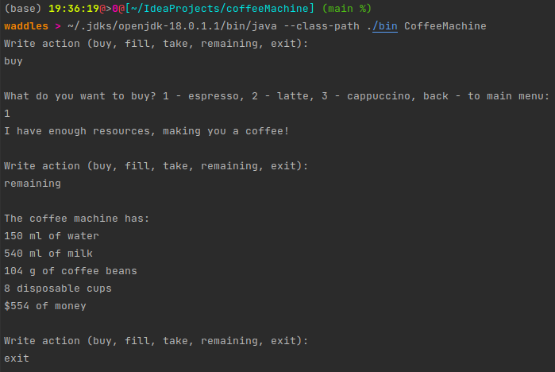

# CoffeeMachine
Little project with console menu

### Example



### Build source
```shell
javac --source-path src/ -d bin src/CoffeeMachine.java
```

### Run
```shell
java --class-path ./bin CoffeeMachine
```

### Create jar
```shell
javac --source-path src/ -d bin src/CoffeeMachine.java
jar cefv CoffeeMachine  coffeeMachine.jar -C ./bin .
```

### Run jar
```shell
java -jar ./coffeMachine.jar
```